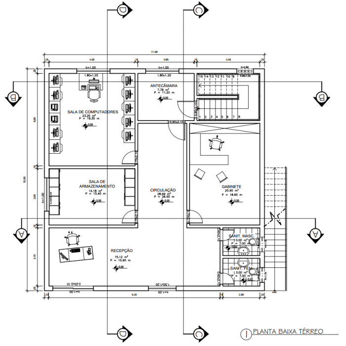

## CHÁCARA MS REPRODUÇÃO BOVINA LTDA.

### Resumo dos principais pontos do plano de negócio

A Chácara MS é um negócio especializado na produção e venda de embriões de bovinos leiteiros da raça holandesa.
Nossa missão é fornecer material genético de alta qualidade para a produção de leite, contribuindo significativamente para o melhoramento genético do rebanho bovino leiteiro do país. Com base em sólidos conhecimentos técnicos e experiência no setor, buscamos posicionar a Chácara MS como um líder reconhecido no mercado de reprodução bovina.

### Dados dos empreendedores, experiência profissional e atribuições

Os empreendedores por trás da Chácara MS são Cristian Alves Silva e Marco Antônio Pires de Carvalho. Cristian é pecuárista com mais de 5 anos de experiência em criação de bovinos e gestão de fazendas, Marco é o sócio responsável pelo marketing e relações públicas em geral da empresa.

Suas principais atribuições são:
**Cristian Alves Silva** Responsável pela seleção da genética e manejo reprodutivo.
**Marco Antônio Pires de Carvalho** Responsável pelo, marketing e relacionamento com os clientes.

### Dados do empreendimento

Nome: Chácara MS
Razão Social: Chácara MS Reprodução Bovina Ltda.
CNPJ: 00.000.000/0000-00
Endereço: Rodovia 040 Km 132, João Pinheiro, Minas Gerais
Telefone: (00) 0000-0000
E-mail: contato@chacarams.com.br
Website: www.chacarams.com.br

### Missão da empresa

A missão da Chácara MS é fornecer material genético de alta qualidade para a produção de leite, contribuindo para o melhoramento genético do rebanho bovino leiteiro do país. Buscamos oferecer embriões com características superiores, selecionados criteriosamente a partir de animais com desempenho genético comprovado. Além disso, nos dedicamos a prestar serviços de consultoria especializada em reprodução bovina, compartilhando nosso conhecimento e experiência com os clientes.

### Setores de atividade

Produção de embriões de bovinos leiteiros da raça holandesa com alto potencial genético.
Venda de embriões para produtores de leite e criadores de gado.
Prestação de serviços de consultoria em reprodução bovina.

### Forma jurídica

A Chácara MS é uma sociedade limitada (Ltda.), constituída de acordo com as leis e regulamentações vigentes.

### Enquadramento tributário

_Âmbito Federal_ A empresa está enquadrada no regime do Simples Nacional, beneficiando-se de uma tributação simplificada e reduzida para micro e pequenas empresas.
_Âmbito Estadual_ Estamos em conformidade com as obrigações tributárias estaduais, seguindo as regras estabelecidas pela Secretaria da Fazenda do Estado.
_Âmbito Municipal_ Cumprimos as obrigações tributárias municipais e atendemos às exigências da prefeitura local.

### Capital Social

O capital social da Chácara MS é de R$ 800.000,00, dividido em cotas. Cristian Alves Silva possui 75% das cotas e Marco Antônio Pires de Carvalho possui 25%.
O que é o negócio
A Chácara MS é uma empresa especializada na produção e comercialização de embriões de bovinos leiteiros da raça holandesa. Nossos embriões são resultado de um rigoroso processo de seleção genética, utilizando animais de linhagens superiores e comprovado desempenho leiteiro. Além disso, oferecemos serviços de consultoria em reprodução bovina, auxiliando os clientes a obterem resultados mais expressivos em seus rebanhos.

### Principais produtos e serviços

_Produção de embriões de bovinos leiteiros:_ Utilizamos as mais avançadas técnicas de reprodução assistida, como a FIV (Fertilização In Vitro) e a transferência de embriões, para produzir embriões de alta qualidade genética.
_Venda de embriões:_ Comercializamos embriões de bovinos da raça holandesa, oferecendo aos produtores de leite e criadores de gado a oportunidade de melhorar geneticamente seus rebanhos e aumentar a produtividade leiteira.
_Consultoria especializada em reprodução bovina:_ Prestamos serviços de consultoria personalizados, incluindo orientações sobre manejo reprodutivo, seleção de animais para reprodução, técnicas de inseminação artificial, monitoramento de cios e outras práticas relacionadas à reprodução bovina.

### Principais clientes

Nossos principais clientes são:

- Produtores de leite que buscam melhorar geneticamente seus rebanhos, aumentar a produtividade e a qualidade do leite.
- Criadores de gado interessados em adquirir embriões de alta linhagem para melhoramento genético, tanto para uso próprio como para revenda.
- Proprietários de propriedades rurais e fazendas que desejam investir em reprodução bovina e obter resultados superiores em seus rebanhos leiteiros.

### Localização da empresa

A Chácara MS está estrategicamente localizada na zona rural do município de Cidade, Estado. A propriedade possui uma área de 100 hectares, dos quais 80 hectares são destinados às instalações da chácara, como pastagens, currais, laboratórios e estruturas de apoio. A localização proporciona acesso facilitado a fornecedores, clientes e áreas de produção de insumos.

### Montante de capital a ser investido

Para iniciar as operações da Chácara MS, será necessário um investimento inicial de aproximadamente R$ 800.000,00. Esse valor será destinado à aquisição de terras, construção de infraestrutura, compra de equipamentos, genética de qualidade, contratação de profissionais especializados e capital de giro para os primeiros meses de atividade.

### Faturamento mensal

Com base em projeções e considerando a capacidade produtiva da chácara, estima-se um faturamento médio mensal de R$ 100.000,00. No entanto, esse valor pode variar de acordo com a demanda do mercado, a disponibilidade de embriões e a capacidade de atendimento da Chácara MS.

### Lucro esperado do negócio

Considerando os custos operacionais, a margem de lucro média esperada é de 30% sobre o faturamento mensal. No entanto, é importante ressaltar que o lucro real pode variar de acordo com fatores como variações nos custos de produção, flutuações do mercado e eficiência operacional.

### Tempo estimado para o retorno do investimento

Com base nas projeções financeiras e considerando a margem de lucro esperada, estima-se que o período de retorno do investimento seja de aproximadamente 4 anos. No entanto, é importante ressaltar que esse prazo pode ser influenciado por diversos fatores, como a demanda do mercado, a eficiência operacional e o crescimento do negócio.

### Fonte de Recursos

A Chácara MS se fincancia principalmente por meio de recursos próprios, investidos pelos sócios. Esses investimentos iniciais permitiram, constuir infraestrutura, comprar equipamentos, contratar profissionais especializados. Utilizar capital próprio oferece controle e autonomia aos empreendedores, além de maior flexibilidade para tomar decisões estratégicas.

### Análise de Mercado

## Clientes

_Pessoa Física_

Faixa etária: Os clientes são, em sua maioria, adultos entre 25 e 50 anos.
Distribuição entre homens e mulheres: Existe um equilíbrio entre homens e mulheres como clientes.
Tamanho da família: A maioria possui famílias pequenas.
Profissão/ocupação: Os clientes possuem diversas ocupações, como agricultores, produtores de leite e pecuaristas.
Faixa de renda: Apresentam uma faixa de renda média a alta.
Nível de escolaridade: Variado, com predominância de pessoas com ensino médio completo.
Localização residencial: Concentrados em áreas rurais e regiões próximas à chácara.

_Pessoa Jurídica_

Ramo de atuação: São produtores de leite, criadores de gado e fazendeiros.
Produtos ou serviços oferecidos: Produção e comercialização de leite e produtos derivados.
Número de funcionários: Varia de acordo com o porte da empresa.
Tempo de atuação no mercado: Algumas empresas são tradicionais, com décadas de atuação, enquanto outras são mais recentes.
Existência de filiais e localização: Algumas possuem filiais em outras regiões do país.
Capacidade de pagamento: Varia de acordo com o tamanho e a estabilidade financeira da empresa.
Reputação no mercado: As empresas são reconhecidas por sua qualidade e confiabilidade.

### Interesses e Comportamentos dos Clientes

Volume e frequência de compra do produto ou serviço: Os clientes adquirem embriões de bovinos leiteiros conforme suas necessidades de melhoramento genético do rebanho.
Locais habituais de compra: Normalmente, os clientes realizam as compras diretamente na Chácara MS.
Preço atualmente pago por produtos ou serviços similares: O preço varia de acordo com a qualidade e o potencial genético dos embriões.

### Fatores que Influenciam a Decisão de Compra

Preço: Os clientes consideram o preço como um fator importante, buscando um bom custo-benefício.
Qualidade dos produtos ou serviços: A qualidade genética dos embriões é um critério decisivo na escolha dos clientes.
Marca: A Chácara MS é reconhecida como uma empresa confiável e com produtos de qualidade.
Prazo de entrega: Os clientes valorizam a agilidade na entrega dos embriões.
Prazo de pagamento: Opções flexíveis de pagamento são bem recebidas pelos clientes.
Atendimento da empresa: Um bom atendimento e suporte técnico são essenciais para os clientes.

### Localização dos Clientes

Tamanho do mercado: O mercado em que a Chácara MS irá atuar abrange uma área regional, incluindo a cidade e regiões vizinhas.
Localização dos clientes: Os clientes estão dispersos principalmente nas áreas rurais próximas à chácara, bem como em cidades e municípios adjacentes.
Alcance geográfico: O foco inicial é atender clientes dentro do estado, buscando estabelecer uma base sólida no mercado local.
Visibilidade da empresa: A localização estratégica da chácara, bem como a divulgação efetiva da empresa por meio de canais de marketing adequados, permitirá que os clientes encontrem a Chácara MS com facilidade.

### Estudo de concorrentes

A Chácara MS possui uma posição privilegiada na região, pois não enfrenta concorrência direta de serviços similares. Isso se deve ao grande déficit de oferta na área, criando uma oportunidade única para a empresa se destacar como líder no mercado de reprodução bovina e venda de embriões de bovinos leiteiros. A falta de concorrência permite à Chácara MS estabelecer-se como referência e conquistar uma base sólida de clientes, enquanto constrói uma reputação sólida e fideliza seus clientes. Essa vantagem competitiva também facilita a expansão da empresa para regiões próximas, ampliando seu alcance e impacto no mercado.

### Estudo de fornecedores

A Chácara MS possui terras próprias e produz a maioria dos insumos necessários. Ela cultiva pastagens e cuida da reprodução bovina. Porém, também estabelece parcerias estratégicas para obter outros insumos, como materiais de laboratório e medicamentos veterinários. A empresa valoriza fornecedores de qualidade, buscando relações de longo prazo baseadas na confiança. A Chácara MS mantém controle rigoroso sobre a qualidade dos insumos recebidos. Essa estratégia garante a qualidade, sustentabilidade e diversificação da cadeia de suprimentos.

### Plano de Marketing

_Principais produtos e serviços_

Produção de embriões de bovinos leiteiros da raça holandesa com alto potencial genético.
Venda de embriões de bovinos leiteiros da raça holandesa.
Prestação de serviços de consultoria especializada em reprodução bovina.

_Preço_

Os preços dos embriões de bovinos leiteiros serão estabelecidos com base na qualidade genética e nas características individuais de cada embrião.
A consultoria especializada em reprodução bovina será oferecida por meio de pacotes personalizados, com preços definidos de acordo com a complexidade e abrangência dos serviços.

_Estratégias promocionais_

Participação em eventos e feiras do setor pecuário para apresentação dos produtos e serviços.
Divulgação por meio de anúncios em revistas especializadas, jornais locais e meios digitais.
Utilização das redes sociais para compartilhar informações sobre a empresa, seus produtos e serviços, além de oferecer conteúdo relevante sobre reprodução bovina.
Programa de indicação: incentivar os clientes satisfeitos a indicarem a Chácara MS para outros produtores e criadores de gado, oferecendo benefícios e descontos especiais.

_Estrutura de comercialização_

Vendas diretas: a Chácara MS estabelecerá contato direto com os clientes interessados em adquirir embriões de bovinos leiteiros, oferecendo um atendimento personalizado.
Parcerias estratégicas: estabelecimento de parcerias com agropecuárias, cooperativas e outros canais de distribuição para ampliar a visibilidade e o alcance dos produtos.
E-commerce: desenvolvimento de uma plataforma online para venda dos embriões e contratação dos serviços de consultoria, proporcionando conveniência e facilidade de acesso aos clientes.

Essas estratégias de marketing visam posicionar a Chácara MS como uma referência no mercado de reprodução bovina, destacando a qualidade genética dos embriões, a expertise em consultoria e o compromisso em oferecer soluções personalizadas para os clientes.

### Plano Operacional

_Layout_

_Capacidade produtiva/comercial/serviços_

A capacidade produtiva da Chácara MS Reprodução Bovina Ltda. será dimensionada de acordo com a infraestrutura disponível e a demanda do mercado. Estimaremos nossa capacidade de produção com base nos seguintes aspectos:

**Produção de Sêmen:**
Implementaremos um programa de coleta de sêmen dos reprodutores selecionados, levando em consideração a qualidade genética, saúde e conformação física. A capacidade produtiva será estabelecida com base na quantidade de sêmen que pode ser coletado, processado e armazenado adequadamente. Para isso, contaremos com uma equipe especializada em coleta e processamento de sêmen, bem como com equipamentos modernos e tecnologicamente avançados.

**Inseminação Artificial:**
Nossa capacidade de serviços de inseminação artificial será projetada levando em conta o número de animais que podemos atender simultaneamente, considerando o tempo necessário para a realização do procedimento. Com base na equipe técnica disponível e nas instalações adequadas para o manejo dos animais, estabeleceremos metas de atendimento e dimensionaremos nossa capacidade produtiva.

**Transferência de Embriões:**
Caso seja aplicável e solicitado pelos clientes, ofereceremos o serviço de transferência de embriões. Para isso, determinaremos nossa capacidade produtiva considerando o número de embriões disponíveis, o tempo necessário para realizar o procedimento e a disponibilidade de receptoras adequadas. Nossa equipe especializada em transferência de embriões garantirá a eficiência e o sucesso desse serviço.

**Comercialização de Produtos e Serviços:**
Além dos serviços de reprodução bovina, comercializaremos produtos relacionados, como sêmen de reprodutores de alta qualidade genética e embriões selecionados. Estabeleceremos parcerias estratégicas com distribuidores e empresas do setor para alcançar um amplo mercado. Nossa capacidade comercial será projetada de acordo com a demanda estimada, considerando a disponibilidade dos produtos e a capacidade de entrega.

É importante ressaltar que, para estimar nossa capacidade produtiva e comercial, consideraremos fatores como o tipo de produto ou serviço oferecido, as instalações e equipamentos disponíveis, a disponibilidade financeira, o fornecimento de insumos e materiais, bem como o tamanho e as oscilações sazonais do mercado.

Com uma capacidade produtiva e comercial bem definida, a Chácara MS Reprodução Bovina Ltda. poderá atender às necessidades dos criadores de gado, garantindo a qualidade e eficiência em todos os processos reprodutivos e fortalecendo sua posição no mercado.

_Processos operacionais_

**Localização e Infraestrutura:**

A Chácara MS Reprodução Bovina Ltda. estará localizada em uma área estratégica para facilitar o acesso dos criadores de gado da região. Nossas instalações contarão com os seguintes espaços:
Área de manejo: Será destinada ao manejo dos animais, com currais, bretes, troncos de contenção e áreas de isolamento.

- Laboratório de reprodução: Contará com equipamentos modernos e adequados para a realização de técnicas de inseminação artificial e transferência de embriões.
- Estoque de materiais: Espaço dedicado ao armazenamento de insumos, materiais e equipamentos necessários para as atividades de reprodução bovina.

- Escritório administrativo: Será o local de trabalho da equipe administrativa, com computadores, telefones e demais recursos necessários para a gestão do negócio.

  **Processos Operacionais:**

  Os processos operacionais da Chácara MS Reprodução Bovina Ltda. incluirão as seguintes etapas:
  Recepção e identificação dos animais: Ao receber os animais, faremos a identificação individual de cada um, registrando informações relevantes para o acompanhamento do processo reprodutivo.

  - Seleção e preparação dos reprodutores: Realizaremos a seleção criteriosa dos reprodutores, levando em consideração critérios genéticos, saúde e conformação física. Os reprodutores serão devidamente preparados para o processo de coleta de sêmen.

  - Coleta e processamento do sêmen: A coleta do sêmen será realizada de forma segura e higiênica, seguindo os protocolos estabelecidos. O sêmen coletado será processado, avaliado e armazenado adequadamente.

  - Inseminação artificial: Utilizaremos técnicas avançadas de inseminação artificial para transferir o sêmen dos reprodutores selecionados para as fêmeas em cio. Todo o procedimento será feito por profissionais especializados.

  - Transferência de embriões: Quando aplicável, realizaremos a transferência de embriões, utilizando embriões de alta qualidade genética e garantindo as condições ideais para a implantação no útero das receptoras.

  - Monitoramento e acompanhamento: Durante todo o processo, faremos um rigoroso monitoramento e acompanhamento dos animais, registrando informações relevantes sobre a evolução do processo reprodutivo e a saúde dos animais.

    **Recursos Humanos:**

  A equipe da Chácara MS Reprodução Bovina Ltda. será composta por profissionais qualificados e experientes, incluindo:

  - Médicos veterinários especializados em reprodução bovina;

  - Técnicos em inseminação artificial e transferência de embriões;

  - Colaboradores administrativos para auxiliar nas atividades burocráticas e de gestão do negócio.

  - Fornecedores:
    Estabeleceremos parcerias estratégicas com fornecedores confiáveis e de qualidade, garantindo o suprimento dos seguintes itens:

    - Materiais e equipamentos de reprodução bovina, como sêmen, embriões, botijões de nitrogênio líquido, materiais de inseminação artificial, entre outros;
    - Insumos para alimentação e cuidados com os animais, como rações, suplementos nutricionais, medicamentos veterinários, entre outros.

    - Controle de Qualidade:
      A Chácara MS Reprodução Bovina Ltda. terá um sistema de controle de qualidade rigoroso, garantindo a excelência em todos os processos relacionados à reprodução bovina. Serão realizados testes, avaliações e auditorias periódicas para assegurar que todos os padrões e normas sejam cumpridos.

  _Cronograma de Atividades:_

  Será elaborado um cronograma de atividades que contemplará todas as etapas do processo reprodutivo, desde a recepção dos animais até a entrega dos resultados aos clientes. Esse cronograma será fundamental para a organização e o cumprimento dos prazos estabelecidos.
  Com um plano operacional bem estruturado e executado, a Chácara MS Reprodução Bovina Ltda. garantirá a eficiência, qualidade e segurança em todas as atividades de reprodução bovina, proporcionando aos criadores de gado a oportunidade de melhorar geneticamente seus rebanhos.

  _Necessidade de pessoal_

A Chácara MS Reprodução Bovina Ltda. reconhece a importância de contar com uma equipe qualificada e comprometida para o sucesso de suas operações. A seguir, apresentamos a necessidade de pessoal em diferentes áreas-chave:

- Gerência:
  Será designado um gerente geral para supervisionar todas as atividades operacionais da chácara. O gerente será responsável por liderar a equipe, tomar decisões estratégicas, gerenciar recursos financeiros e garantir o cumprimento dos objetivos estabelecidos.

- Equipe Técnica:
  Contaremos com uma equipe técnica especializada, composta por médicos veterinários, zootecnistas e profissionais capacitados em reprodução bovina. Essa equipe será responsável por realizar as coletas de sêmen, realizar os procedimentos de inseminação artificial e transferência de embriões, realizar exames de saúde nos animais, monitorar o ciclo reprodutivo, entre outras atividades relacionadas à reprodução bovina.

- Equipe de Manejo:
  Uma equipe de manejo de animais será responsável por cuidar dos reprodutores, receptoras e demais animais presentes na chácara. Essa equipe será encarregada de alimentar os animais, realizar a limpeza dos recintos, cuidar da saúde e bem-estar dos animais, além de auxiliar nos procedimentos de coleta de sêmen, inseminação artificial e transferência de embriões.

- Equipe Administrativa:
  Para garantir o bom funcionamento dos processos administrativos e financeiros, contaremos com profissionais especializados em áreas como contabilidade, recursos humanos, compras e vendas. Essa equipe será responsável por cuidar da gestão financeira, realizar o controle de estoque, gerenciar as transações comerciais, lidar com fornecedores e clientes, entre outras atividades administrativas.

- Suporte Técnico e Manutenção:
  Para garantir o pleno funcionamento dos equipamentos e das instalações, será necessário contar com profissionais de suporte técnico e manutenção. Essa equipe será responsável por realizar a manutenção preventiva e corretiva dos equipamentos utilizados na coleta de sêmen, inseminação artificial, transferência de embriões, bem como cuidar das instalações físicas da chácara.
